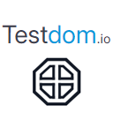

  

<h1 align="center">Testdom.io</h1>

  <strong>Testdom.io</strong> is an all-in-one no-code platform for monitoring, automating, and improving web performance.  
  Run real Lighthouse audits, track Core Web Vitals, and build visual test flows — all from a simple, powerful dashboard.

---

## 🌐 Website
[https://testdom.io](https://testdom.io)

## 🧩 Chrome Extension
[Testdom.io Flow Recorder](https://chromewebstore.google.com/detail/testdomio-flow-recorder/phnllfedihnhbadjdciackmglnnonmdp)

## ✍️ Create Your Account  
[https://app.testdom.io/signup](https://app.testdom.io/signup)

---

## 🔹 Key Features

- 🔹 Core Web Vitals Monitoring (FCP, LCP, CLS, TTFB, etc.)
- 🔹 Automated Lighthouse tests with custom throttling and mobile emulation
- 🔹 Visual user flow builder (Blockly-style interface)
- 🔹 Record and replay user test sessions (via Chrome Extension)
- 🔹 OTP handling and inbox automation
- 🔹 Email alerts when thresholds are breached
- 🔹 Full test history, CI/CD integration, and GA4 tracking options

---

## 📘 Docs & Guides

- 📘 [Core Web Vitals – How to Stay on Top](https://testdom.io/webvitals/web-vitals)
- 📘 [How to Monitor Web Vitals](https://testdom.io/webvitals/how-to-monitor-web-vitals-with-testdom-io)
- 📘 [First Contentful Paint (FCP)](https://testdom.io/webvitals/performance/first-contentful-paint)
- 📘 [Largest Contentful Paint (LCP)](https://testdom.io/webvitals/performance/largest-contentful-paint)
- 📘 [Cumulative Layout Shift (CLS)](https://testdom.io/webvitals/performance/cumulative-layout-shift)
- 📘 [Time To First Byte (TTFB)](https://testdom.io/webvitals/performance/time-to-first-byte)
- 📘 [Time To Interactive (TTI)](https://testdom.io/webvitals/performance/time-to-interactive)
- 📘 [Search Index – SEO Discoverability Metric](https://testdom.io/webvitals/seo-and-accessibility/search-index)

---

## 💬 Support

Have questions or feedback? Reach out anytime:  
📩 [support@testdom.io](mailto:support@testdom.io)

---

© 2025 Solid Code LTD. All rights reserved.

